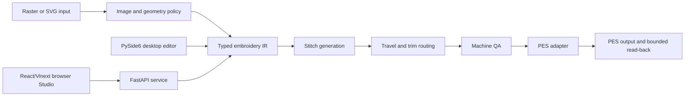

# KSuite — Engineering Manifest

> Public engineering record for KSuite. Implemented behavior, observed
> verification, publication limits, and future work are kept distinct.

KSuite is a local-first embroidery digitizing system with a shared production
engine, desktop editor, HTTP API, browser Studio, deterministic stitch routing,
machine-aware QA, and PES export/read-back validation. It is a proprietary
personal project architected and directed by Joshua Wilkinson. Development was
materially AI-assisted through collaborative design and coding; claims here
describe the resulting system and its observed evidence without presenting it
as unaided or exclusively hand-written work.

## 1. Product and engineering goal

The product converts raster or vector artwork into a machine-oriented embroidery
design while preserving meaningful visual structure. The engineering problem is
not simply image conversion: the output must fit a physical hoop, use sensible
stitch density, preserve small features, manage travel and trims, represent
thread changes, and survive PES serialization.

The central design principle is to carry production semantics through the whole
pipeline instead of judging correctness from a screen preview alone.

```text
PNG / JPG / WEBP / SVG
        ↓
physical geometry + semantic regions
        ↓
typed embroidery intermediate representation
        ↓
stitch generation + deterministic routing
        ↓
production QA + PES read-back validation
```

## 2. System architecture



The desktop path and API path call the same production pipeline. The browser
Studio manages projects and previews through the service; it does not claim a
production export when the service is disconnected. The asynchronous API job
store is process-local, not a durable or distributed queue.

## 3. Technology and responsibility boundary

| Layer | KSuite responsibility | External dependency boundary |
| --- | --- | --- |
| Typed representation | Commands, stitches, sequences, material policy, and operation ordering | KSuite-owned model; no PES binary codec claimed |
| Raster/color analysis | Color-family policy, adaptive shades, regularization, residual recovery, coverage, foundation, and clearance | OpenCV and NumPy provide low-level image and array primitives |
| Geometry/topology | Mask-constrained routing, principal-axis analysis, skeleton graph traversal, branch walks, and edge decomposition | OpenCV provides image morphology; KSuite owns graph and routing policy |
| Stitch generation | Running, bean/detail, outline, tatami/fill, satin, border, underlay, density, and pull-compensation policy | NumPy/OpenCV geometry primitives |
| Orchestration | Immutable requests/results, signatures, workers, retries, source survival, operation ordering, cleanup, and QA | Python process pool executes workers |
| Routing | Greedy ordering, reversible endpoints, gap routing, relocations, and trim repair | KSuite heuristic; not a global optimizer |
| Machine QA | Hoop/profile limits, fit scaling, short-stitch cleanup, moves, trims, and reports | Configured profile policy |
| PES output | Maps typed commands, threads, color changes, trims, and ties into a pattern | `pyembroidery` encodes and decodes the PES binary format |
| SVG | Physical-scale normalization and path/attribute mapping | `svgpathtools` parses SVG paths |
| Desktop | Editor, project state, preview, and simulation surface | PySide6 provides the desktop UI framework |
| Service | Synchronous and asynchronous processing endpoints | FastAPI, Pydantic, and Uvicorn provide the HTTP stack |
| Browser | Project management, previews, and service orchestration | React/Vinext provides the browser surface |

This boundary is important: KSuite owns the production decisions and typed
machine plan, while dependencies provide reusable primitives or serialization.

## 4. Import, color, and topology pipeline

The importer treats alpha, connected components, and semantic regions as
production inputs. Its policy includes:

- LAB-space perceptual color-family clustering;
- seeded/adaptive shade allocation and regularization;
- coverage and foundation rules;
- residual recovery for meaningful source pixels;
- connected-component analysis and counter preservation;
- contour stabilization and clearance policy; and
- source-survival checks that protect small details during retries.

Geometry processing includes principal-axis analysis, mask-constrained A*,
morphological skeletonization, custom skeleton graph decomposition, branch
preservation, deterministic traversal, and edge decomposition. OpenCV supplies
the low-level image operations; the region policy and graph behavior are KSuite
engineering.

## 5. Typed embroidery intermediate representation

The intermediate representation preserves distinctions that a preview image
cannot express reliably:

- needle stitches versus exposed travel;
- trims, tie-ons, tie-offs, stops, and color changes;
- ordered operations and semantic regions;
- thread and material policy;
- target density and stitch spacing; and
- geometry and production metrics.

The representation allows later stages to make machine-aware decisions without
reconstructing semantics from pixels. It also provides a stable seam between
import, stitch generation, routing, QA, desktop display, API responses, and
PES mapping.

## 6. Stitch generation and production orchestration

The stitch engine selects strategies from the classified region and material
policy. Implemented strategies include:

- running stitches and bean/detail variants;
- outlines and closed borders;
- tatami/fill generation;
- satin generation;
- edge, center, contour, and fill underlay; and
- material-aware density and pull-compensation application.

The production pipeline uses immutable request/result boundaries, generation
signatures, ordered operations, multiprocessing, bounded density retries,
source-survival checks, cleanup, and production QA. Retries may adjust density
or scale within policy while protecting meaningful small regions.

The system does not claim a hard stitch-budget guarantee for every possible
input: after bounded attempts, a result can still exceed the target. That is a
known engineering boundary rather than an omitted qualification.

## 7. Routing and machine policy

Travel optimization currently uses a deterministic greedy nearest-neighbor
heuristic with reversible endpoints, gap routing, relocations, and trim repair.
It is designed to reduce wasteful travel and exposed long moves, not to claim
global optimality.

Machine profiles provide data-backed hoop dimensions, continuous working fields,
fit scaling, short-stitch cleanup, and reporting thresholds. The configured
Brother profiles include SA431/EF61, SA432/EF62, and SA434/EF71 sizes. The
SA434 profile is treated as multi-position/noncontinuous, so its effective
continuous field is constrained separately from its overall hoop area.

The implementation detects when an input requires a split or reposition. It
does not claim automatic multi-position split/reposition PES generation.

## 8. PES export and validation boundary

KSuite maps its typed command stream to the `pyembroidery` pattern/thread model,
including stitches, thread changes, trims, and ties. `pyembroidery` performs
the binary PES encoding and decoding.

The read-back gate verifies bounded decoding, headers, and positive counts. It
does not establish complete command equivalence, geometry equivalence, machine
acceptance, or physical sewability. A valid software read-back is therefore
necessary evidence for the export path, not a substitute for a sew-out.

## 9. Interfaces and user workflow

The PySide6 desktop editor provides project/layer/property surfaces, stitch and
thread simulation, and preview-oriented interaction. The FastAPI service
provides synchronous processing and process-local asynchronous job lifecycle.
The React/Vinext browser Studio manages projects, local browser persistence, API
orchestration, and previews.

The interface boundary intentionally fails closed for production export when the
processing service is unavailable. Browser project persistence is local to the
browser and is not presented as a server-backed collaboration system.

## 10. Verification record

The following observations were made in a controlled engineering verification
run and are scoped to the stated environment and inputs:

- 44 Python tests passed, covering importer/color/topology, production
  classification, density/source survival/detail/layer order, QA semantics, SVG
  normalization, routing/trims, synchronous and asynchronous API processing,
  settings, and PES responses.
- The web build/lint path completed successfully. The retained web test covered
  the storefront surface; it did not establish complete browser Studio
  end-to-end coverage.
- A raster-to-operations-to-stitches-to-PES-to-read-back run completed with 4
  operations, 39 regions, and 15,786 needle stitches before PES encoding.
- Repeating the same audited input in the same environment produced identical
  PES and preview hashes.
- A bounded one-input benchmark measured a 1.61× mean speedup with four worker
  processes versus one worker across two repeats, with matching region and
  stitch counts.

These are computational and controlled-run observations. They are not claims
of universal determinism, production-scale throughput, broad adoption, or
physical sewability.

## 11. Evidence classification

The case study uses the following conservative vocabulary:

| Classification | Meaning |
| --- | --- |
| Verified implemented | Traced through an active source path or executable entry point |
| Verified tested | Traced implementation plus a relevant fresh test or bounded verification run |
| Verified deployed | A named external surface or artifact was directly reachable during verification |
| Documented, not verified | Present as owner statement, configuration, sample, or incomplete boundary |
| Planned | Explicitly future, disabled, or placeholder work |
| Historical | Deleted, replaced, or outside the current path |
| Unknown | The repository and executed checks do not establish the claim |

The status always applies to the precise claim. A passing software test does not
establish physical sewability, and a reachable service does not prove that it
matches a particular local source snapshot.

## 12. Constraints and future work

Known constraints and planned improvements include:

- establish a hard stitch-budget invariant for all inputs;
- evaluate whether a stronger global routing strategy is justified by measured
  workloads;
- implement and verify automatic multi-position split/reposition output;
- add durable/distributed job storage if deployment requires it;
- add browser-to-Studio end-to-end tests;
- bind packaging to reproducible clean-environment builds;
- complete public signing/notarization for macOS distribution;
- add authentication, abuse controls, logging, and upload-retention policy at
  any public processing boundary; and
- add physical sew-out evidence for representative materials and machines.

Payment/order behavior is not a shipped feature. Adoption, uptime, reliability,
and quantified business impact are not established by this manifest.

## 13. Publication boundary

KSuite is proprietary. The public Git remote is not the complete current
implementation; modern work and deeper verification materials are controlled.
This public case study intentionally excludes private filesystem paths,
deployment controls, credentials, raw source snapshots, content-addressed
artifacts, un-cleared artwork/output files, and claims that cannot be
independently supported.

Technical access may be provided through an owner-approved serious-inquiry
process. The architecture and verification summary here is intended to be
useful on its own without exposing proprietary implementation details.

## 14. Engineering summary

KSuite demonstrates end-to-end product engineering across computational
geometry, image analysis, machine constraints, typed intermediate
representations, stitch generation, desktop software, HTTP services, browser
tooling, binary export boundaries, testing, deterministic processing, and
performance investigation. Its strongest engineering quality is the explicit
connection between source artwork, semantic operations, physical machine
policy, and verified output behavior.
