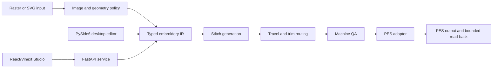

# KSuite — Product Engineering Case Study

KSuite is a local-first embroidery digitizing system built around a shared
production engine. It combines a desktop editor, a FastAPI service, a browser
Studio, deterministic stitch generation, machine-aware quality checks, and PES
export/read-back validation.

## Engineering overview

The detailed [`ENGINEERING_MANIFEST.md`](ENGINEERING_MANIFEST.md) documents the
system’s architecture, implementation boundaries, verification record,
performance observations, limitations, and next engineering priorities.

KSuite is a proprietary personal project architected and directed by Joshua
Wilkinson. The implementation was materially AI-assisted through collaborative
design and coding, with the resulting system tested and reviewed as an
engineering artifact. The case study describes the work precisely: dependency
responsibilities, observed verification, and unresolved evidence are not
blurred together.

## The product problem

Embroidery software has a stricter definition of “works” than a screen preview.
The output must respect physical dimensions, machine hoop limits, stitch
budgets, trims, relocations, thread changes, and the topology of the original
artwork. A visually plausible preview can still produce an unsafe or unusable
machine file.

KSuite addresses that problem by making production constraints explicit from
import through export:

```text
PNG / JPG / WEBP / SVG
        ↓
physical geometry + semantic regions
        ↓
typed embroidery intermediate representation
        ↓
stitch generation + deterministic routing
        ↓
production QA + PES read-back validation
```

## What the engineering work covers

- A typed embroidery intermediate representation for commands, stitches,
  sequences, materials, thread changes, trims, ties, and ordering.
- Perceptual color-family analysis, adaptive shade allocation, regularization,
  residual recovery, connected-component analysis, coverage checks, and
  clearance policy.
- Custom geometry and topology processing, including mask-constrained A*,
  principal-axis analysis, skeleton graphs, branch-preserving traversal, and
  edge decomposition.
- Running, bean, detail, tatami/fill, satin, border, and underlay generation,
  with material-aware density and pull-compensation policy.
- Deterministic operation ordering, stitch-budget attempts, density retries,
  source-survival protection, travel optimization, gap routing, relocations,
  trims, and endpoint reversal.
- Data-backed Brother hoop profiles, fit checks, short-stitch cleanup, movement
  metrics, and production reports.
- A PES adapter that maps KSuite’s typed command stream into the
  `pyembroidery` pattern model and performs bounded read-back checks.
- A PySide6 desktop editor, FastAPI/Pydantic/Uvicorn service, and React/Vinext
  browser Studio over the same production pipeline.

## System design



The desktop application and web service share the production engine. The
browser can manage projects and previews, but production export is not claimed
when the service is unavailable. API job state is process-local rather than a
durable distributed queue.

## Engineering decisions

### Physical units are explicit

Import, geometry, hoop fit, stitch spacing, and production reports operate in
physical units rather than treating pixels as a machine measurement.

### Semantics survive into the machine plan

Needle stitches, travel, trims, ties, stops, and thread changes remain distinct
typed commands. This allows routing and QA to reason about production behavior
instead of optimizing only a preview image.

### Alpha and topology are authoritative

The importer preserves meaningful transparent regions and does not invent a
full-design base fill. Small details and connected components are protected
through density retries and source-survival checks.

### Machine policy is data-backed

Hoop dimensions, continuous working fields, fit scaling, movement limits, and
reporting thresholds are profile-driven. Oversize/split requirements are
detected explicitly; automatic multi-position split generation is not claimed
as implemented.

### Third-party responsibilities are explicit

KSuite owns its intermediate representation, analysis policy, geometry, stitch
generation, orchestration, routing, QA, and adapter mapping. OpenCV and NumPy
provide low-level array, color, contour, morphology, and numerical primitives.
`pyembroidery` owns PES binary encoding and decoding; KSuite does not claim to
implement the PES binary format itself.

### Determinism is tested, not assumed

The audited input produced bit-identical PES and preview outputs on repeated
runs in the same environment. That is evidence for same-input,
same-environment repeatability, not a guarantee across every platform,
dependency version, or production-scale input.

## Verification snapshot

The engineering manifest records the full verification ledger. The public
summary is:

- 44 Python tests passed in the audited environment, covering importer policy,
  topology, production classification, density/source survival, QA semantics,
  SVG normalization, routing/trims, API processing, async jobs, settings, and
  PES responses.
- The web build/lint path completed successfully; the retained web test covered
  the storefront surface, not a complete browser-to-Studio workflow.
- A fresh raster → operations → stitches → PES → read-back run completed with
  4 operations, 39 regions, and 15,786 needle stitches before PES encoding.
- Repeated generation of that audited input produced identical PES and preview
  hashes.
- A bounded one-input benchmark measured a 1.61× mean speedup with four worker
  processes versus one worker across two repeats. This is an observation for
  that input and hardware, not a general scalability claim.

Software verification establishes computational behavior. It does not replace
a physical sew-out on a specified machine, fabric, stabilizer, needle, and
thread.

## Honest constraints

- The routing strategy is a deterministic greedy heuristic, not a globally
  optimal TSP solver.
- Bounded density retries do not establish a hard stitch-budget invariant for
  every possible input.
- A configured minimum stitch length is a model constraint, not proof of an
  observed physical detail result.
- PES read-back validates bounded decoding and positive counts; it does not
  prove complete command equivalence, machine acceptance, or sewability.
- API jobs are process-local and expire; they are not durable or distributed.
- Current web checks do not automatically test the full browser Studio flow.
- Packaging exists as configuration, but public signed/notarized macOS release
  remains future work.
- Payment/order backend behavior is not a shipped feature.
- The public Git remote should not be represented as the complete current
  proprietary implementation.

## Repository relationship

The main KSuite repository contains the public source baseline. The full
current implementation and deeper verification materials are proprietary and
available only through an owner-approved serious-inquiry process. This case
study intentionally documents the architecture and evidence without exposing
private source snapshots, credentials, deployment controls, or un-cleared
artwork/output artifacts.

## Status

Active personal project. The system demonstrates end-to-end product engineering
across computational geometry, image analysis, production constraints,
desktop software, HTTP services, browser tooling, machine-file export, testing,
and performance investigation.
